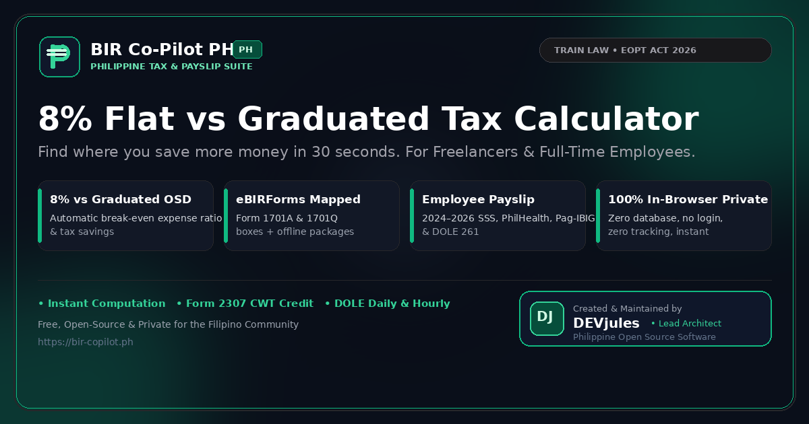

<div align="center">

# BIR Co-Pilot PH 🇵🇭
### The Modern, Free & Open-Source Philippine Tax & Payslip Suite

[-black?logo=next.js)](https://nextjs.org/)
[](https://www.typescriptlang.org/)
[](https://tailwindcss.com/)
[](tests/tax-engine.test.ts)
[](https://www.bir.gov.ph)
[](src/app/privacy/page.tsx)
[](LICENSE)

<br />



<br />

**Find out where you save more money in 30 seconds.**  
Designed specifically for **Filipino Freelancers, Self-Employed Professionals, Sole Proprietors, Mixed Income Earners, and Corporate Employees**.

[Live Web App](http://localhost:3002) • [eBIRForms Official Portal](https://www.bir.gov.ph/ebirforms) • [Report Issue](https://github.com/crdo0923/BIR_calculator/issues)

</div>

---

## 📑 Table of Contents
- [Why BIR Co-Pilot PH?](#-why-bir-co-pilot-ph)
- [Key Features](#-key-features)
  - [1. Freelancer & Business Suite](#1-freelancer-professional--business-suite)
  - [2. Full-Time Employee Payroll & Payslip Suite](#2-full-time-employee-payroll--payslip-suite)
  - [3. Modern SaaS Experience & Mobile Dock](#3-modern-saas-experience--mobile-dock)
- [Tax Engines & Statutory Formulas](#-tax-engines--statutory-formulas)
  - [8% Flat Rate vs Graduated OSD](#8-flat-rate-vs-graduated-osd)
  - [Creditable Withholding Tax (CWT Form 2307)](#creditable-withholding-tax-cwt-form-2307)
  - [eBIRForms Itemized Line Mapping](#ebirforms-itemized-line-mapping)
  - [Employee Statutory Contributions (2024–2026)](#employee-statutory-contributions-20242026)
  - [DOLE Factor 261 Wage Conversion](#dole-factor-261-wage-conversion)
- [Official Offline Forms Directory](#-official-offline-forms-directory)
- [Project Architecture](#-project-architecture)
- [Getting Started](#-getting-started)
- [Automated Verification & Tests](#-automated-verification--tests)
- [Author & Acknowledgements](#-author--acknowledgements)
- [License](#-license)

---

## 💡 Why BIR Co-Pilot PH?

Navigating Philippine tax laws shouldn't be confusing, stressful, or expensive. Most available online calculators are either locked behind paid SaaS payroll subscriptions, limited to full-time employees, or filled with intrusive advertisements.

**BIR Co-Pilot PH** bridges this gap:
1. **Unified Dual Engine:** Covers both Freelance/Self-Employed tax regimes and Corporate Employee monthly payslips in one cohesive application.
2. **Precision Statutory Compliance:** Fully certified against the **TRAIN Law (RA 10963)**, the **Ease of Paying Taxes Act (RA 11976)**, and updated 2024–2026 SSS, PhilHealth, and Pag-IBIG circulars.
3. **100% In-Browser Privacy:** All computations run directly in your browser using client-side TypeScript. No financial data, income numbers, or names are ever uploaded to a server or tracking database.

---

## 🌟 Key Features

### 1. Freelancer, Professional & Business Suite
- **8% Flat Rate vs. Graduated Rates (OSD & Itemized):**
  Instantly computes your tax liability under all regimes side-by-side, highlights the winning strategy, and displays your exact annual savings in pesos.
- **Form 2307 Creditable Withholding Tax (CWT) Deduction:**
  Subtracts 5%, 10%, or custom withholding tax credits directly from your tax due, displaying your true out-of-pocket cash payable to the BIR.
- **Break-Even Expense Analyzer:**
  Calculates the exact expense ratio (typically **56.25% of gross**) required before Graduated Itemized deductions become more economical than the 8% Flat Rate.
- **eBIRForms Itemized Line Mapping:**
  Maps your calculation directly to **Item 15, 16, 17, 18, 19, 20, and 21** for BIR Form 1701A, 1701Q, and 1701. Includes a **1-Click Text Worksheet Export (.txt)**.
- **1-Tap Maya & GCash App Launchers:**
  Deep-link launchers (`paymaya://` / `gcash://`) to launch your e-wallet mobile apps directly from your smartphone, paired with a 1-click **Copy Net Tax Amount** utility.
- **Filing Deadlines Calendar:**
  Clear quarterly and annual tax schedule so you never incur 25% surcharges or 12% annual delinquency interest.

### 2. Full-Time Employee Payroll & Payslip Suite
- **2024–2026 Statutory Schedules:**
  - **SSS (RA 11199):** 14% contribution rate (4.5% Employee / 9.5% Employer) + Employees' Compensation (EC) fund up to ₱30,000 MSC.
  - **PhilHealth (RA 11223):** 5% premium rate (2.5% Employee / 2.5% Employer, ₱10,000 floor & ₱100,000 ceiling).
  - **Pag-IBIG HDMF (RA 9679):** 2% rate with updated ₱10,000 maximum salary ceiling (₱200 Employee / ₱200 Employer).
- **DOLE Factor 261 Wage Converter:**
  Computes equivalent daily and hourly rates under official DOLE guidelines for 5-day work weeks `(Annual Salary / 261)`.
- **Total Cost to Company (CTC):**
  Transparently itemizes employer statutory shares so founders and team leads know the true cost of employment.
- **De Minimis Tax-Exempt Allowances Guide:**
  Collapsible accordion detailing non-taxable fringe benefit caps (Rice Subsidy ₱2,000/mo, Clothing ₱6,000/yr, Laundry ₱300/mo, Medical ₱10,000/yr) under BIR RR 11-2018.
- **Substituted Filing (Form 2316) Guide:**
  Explains conditions where qualified employees are exempt from filing an annual Form 1700.

### 3. Modern SaaS Experience & Mobile Dock
- **Tailwind CSS & Turbopack UI:**
  Clean emerald squircle branding, high-contrast segmented mode switchers, rounded-3xl card containers, and tabular figures.
- **Thumb-Friendly Mobile Bottom Dock:**
  Dedicated 4-button mobile navigation bar (`Mode`, `Pay Tax`, `eBIRForms`, `Laws`) with iOS/Android gesture safe-area insets (`env(safe-area-inset-bottom)`).
- **Bilingual Support:**
  Instant toggle between 🇺🇸 **English** and 🇵🇭 **Tagalog** across all calculation labels, tooltips, and statutory summaries.
- **Zero Horizontal Overflow:**
  Rigorously tested to ensure 0px horizontal scroll on all modern mobile viewports (375px–430px).

---

## ⚖️ Tax Engines & Statutory Formulas

### 8% Flat Rate vs Graduated OSD

#### 1. 8% Flat Rate Regime (Sec. 24(A)(2)(b) & RR 8-2018)
Available to individuals whose gross sales/receipts do not exceed the **₱3,000,000 VAT threshold** and are not subject to other percentage taxes.
- **Pure Self-Employed / Freelancer:**
  $$\text{Tax Due} = (\text{Gross Annual Sales} - \text{₱}250,000) \times 8\%$$
- **Mixed Income Earner (Compensation + Business):**
  $$\text{Tax Due} = \text{Gross Business Sales} \times 8\%$$
  *(Under RR 8-2018, the ₱250,000 tax-free deduction is applied exclusively to compensation income).*
- **Percentage Tax:** **0%** (Section 116 Percentage Tax is waived under the 8% regime).

#### 2. Graduated Rates + 40% Optional Standard Deduction (OSD)
- **Net Taxable Income:**
  $$\text{Taxable Base} = \text{Gross Annual Sales} \times (1 - 0.40) = \text{Gross Annual Sales} \times 60\%$$
- **Income Tax Due:** Computed using the **TRAIN Law 2023–2026 Graduated Tax Table**:
  - ₱0 to ₱250,000: **0%**
  - Over ₱250,000 to ₱400,000: **15%** of excess over ₱250,000
  - Over ₱400,000 to ₱800,000: ₱22,500 + **20%** of excess over ₱400,000
  - Over ₱800,000 to ₱2,000,000: ₱102,500 + **25%** of excess over ₱800,000
  - Over ₱2,000,000 to ₱8,000,000: ₱402,500 + **30%** of excess over ₱2,000,000
  - Over ₱8,000,000: ₱2,202,500 + **35%** of excess over ₱8,000,000
- **Percentage Tax:** Non-VAT taxpayers must additionally pay **3% Percentage Tax** under Section 116 via Quarterly Form 2551Q.

---

### Creditable Withholding Tax (CWT Form 2307)
When clients withhold creditable tax at source (e.g. 5% under ATC `WI158` or 10% under `WI159`), that amount is legally considered advance tax payments:
$$\text{Net Tax Payable} = \max(0, \text{Total Income Tax Due} - \text{Creditable Form 2307 Withholding})$$
If Form 2307 credits exceed Tax Due, the result is an **Overpayment** eligible for carry-over to subsequent quarters or a tax refund certificate.

---

### eBIRForms Itemized Line Mapping
Matches the official layout of **BIR Form 1701A (Page 2, Part V - Tax Computation)**:

| eBIRForms Line | Field Name in Return | 8% Flat Rate Formula / Input |
| :--- | :--- | :--- |
| **Line 15** | Gross Sales / Receipts / Revenues / Fees | Total Gross Sales / Receipts for the year |
| **Line 16** | Less: Allowable Reduction | ₱250,000.00 *(Pure Freelancer only)* |
| **Line 17** | Taxable Income | Line 15 minus Line 16 |
| **Line 18** | Tax Due | Line 17 multiplied by 8% |
| **Line 19** | Tax Credits / Payments | Sum of Form 2307 CWT + Prior Quarters |
| **Line 20** | Net Tax Payable / (Overpayment) | Line 18 minus Line 19 |
| **Line 21** | Penalties (Surcharge, Interest, Compromise) | Late filing penalty *(₱0.00 if timely)* |

---

### Employee Statutory Contributions (2024–2026)

| Contribution | Governing Law | Employee Share | Employer Share | Salary Ceiling |
| :--- | :--- | :--- | :--- | :--- |
| **SSS** | RA 11199 & PD 626 | 4.5% of MSC | 9.5% of MSC + EC (₱10/₱30) | ₱30,000.00 MSC |
| **PhilHealth** | RA 11223 | 2.5% of Monthly Basic | 2.5% of Monthly Basic | ₱100,000.00 Max (₱10k Floor) |
| **Pag-IBIG** | RA 9679 & Circular 460 | 2.0% (capped at ₱200) | 2.0% (capped at ₱200) | ₱10,000.00 Max Cap |

---

### DOLE Factor 261 Wage Conversion
Under the DOLE Handbook on Workers' Statutory Monetary Benefits (for private employees working 5 days a week):
$$\text{Equivalent Daily Rate} = \frac{\text{Monthly Basic Salary} \times 12}{261}$$
$$\text{Equivalent Hourly Rate} = \frac{\text{Equivalent Daily Rate}}{8}$$

---

## 📂 Official Offline Forms Directory

To guarantee 100% reliability and eliminate 404/403 hotlink errors caused by government CDN bot challenges, all official forms are bundled directly in `public/forms/`:

| File Name | Size | Description & Legal Purpose |
| :--- | :--- | :--- |
| [`BIR-Form-1701A.pdf`](public/forms/BIR-Form-1701A.pdf) | 88 KB | Annual Income Tax Return for Pure Individuals (8% & OSD) |
| [`BIR-Form-1701Q.pdf`](public/forms/BIR-Form-1701Q.pdf) | 49 KB | Quarterly Income Tax Return for Individuals & Freelancers |
| [`BIR-Form-1701.pdf`](public/forms/BIR-Form-1701.pdf) | 49 KB | Annual Income Tax Return for Mixed Income Individuals |
| [`BIR-Form-2551Q.pdf`](public/forms/BIR-Form-2551Q.pdf) | 48 KB | Quarterly 3% Percentage Tax Return (Section 116) |
| [`BIR-Form-2307.pdf`](public/forms/BIR-Form-2307.pdf) | 48 KB | Certificate of Creditable Tax Withheld At Source (CWT) |
| [`BIR-Form-2316.pdf`](public/forms/BIR-Form-2316.pdf) | 48 KB | Certificate of Compensation Payment / Tax Withheld |
| [`BIR-Form-1901.pdf`](public/forms/BIR-Form-1901.pdf) | 48 KB | Taxpayer Registration Form (Updated for EOPT Act RA 11976) |
| [`Offline-eBIRForms-Package-v7.9.4.2.zip`](public/forms/Offline-eBIRForms-Package-v7.9.4.2.zip) | 162 KB | Official Offline eBIRForms v7.9.4.2 Suite + Windows Guide |

---

## 🏗️ Project Architecture

```text
bir-co-pilot/
├── public/
│   ├── forms/                  # Built-in authentic BIR PDF forms & offline package
│   ├── apple-touch-icon.png    # iOS Safari Home Screen icon
│   ├── icon-192.png            # Android PWA launcher icon
│   ├── icon-512.png            # High-res splash icon
│   └── og-image.png            # 1200x630 social share preview card
├── src/
│   ├── app/
│   │   ├── layout.tsx          # Global root layout, fonts, and OpenGraph metadata
│   │   ├── page.tsx            # Main application canvas & state coordinator
│   │   ├── privacy/            # Privacy Policy (Republic Act No. 10173 compliance)
│   │   └── terms/              # Terms of Service & Educational Disclaimer
│   ├── components/
│   │   ├── Header.tsx          # Sticky header + 4-button mobile bottom dock
│   │   ├── IncomeConfig.tsx    # Freelancer gross income, CWT, and expense inputs
│   │   ├── TaxWinnerHero.tsx   # Top recommendation banner & savings indicator
│   │   ├── ComparisonCards.tsx # Side-by-side 8% vs Graduated OSD comparisons
│   │   ├── EBIRFormsModal.tsx  # eBIRForms line 15–21 mapper + .txt export
│   │   ├── PaymentFilingGuideModal.tsx # Maya/GCash 1-tap launchers & bank guides
│   │   ├── EmployeeSalaryCalculator.tsx # SSS, PhilHealth, Pag-IBIG payslip engine
│   │   ├── TaxGlossaryModal.tsx # 12 tax terms + 11 statutory Republic Acts
│   │   └── CookieConsent.tsx   # In-browser privacy preferences modal
│   └── lib/
│       ├── tax-engine.ts       # Pure functional Philippine tax calculation engine
│       ├── tax-types.ts        # TypeScript interfaces for tax returns & deductions
│       └── translations.ts     # Complete English ⇄ Tagalog bilingual dictionary
└── tests/
    └── tax-engine.test.ts      # Automated unit & compliance test suite (11 tests)
```

---

## 🚀 Getting Started

### Prerequisites
- **Node.js**: `v18.17.0` or higher (Node.js 20 or 22 recommended)
- **Package Manager**: `npm`, `pnpm`, or `yarn`

### Installation & Local Setup

```bash
# 1. Clone the repository
git clone https://github.com/crdo0923/BIR_calculator.git
cd BIR_calculator

# 2. Install dependencies
npm install

# 3. Start the Next.js development server
npm run dev -- --port 3002
```

Open [http://localhost:3002](http://localhost:3002) in your browser.  
To access from a smartphone on the same local Wi-Fi, run with `--hostname 0.0.0.0` and browse to your machine's LAN IP (e.g. `http://192.168.100.143:3002`).

---

## 🧪 Automated Verification & Tests

Run the comprehensive test suite verifying TRAIN law graduated brackets, 8% break-even points, SSS/PhilHealth/Pag-IBIG tables, and file integrity:

```bash
# Run unit & compliance test suite
npm test

# Run ESLint check (Zero warnings standard)
npm run lint

# Compile optimized static production build
npm run build
```

---

## 👤 Author & Acknowledgements

- **Lead Architect & Creator:** **DEVjules** ([@DEVjules](https://github.com/crdo0923))
- **Official References:** Bureau of Internal Revenue (BIR Philippines), Social Security System (SSS), Philippine Health Insurance Corporation (PhilHealth), Home Development Mutual Fund (Pag-IBIG), Department of Labor and Employment (DOLE).

---

## 📄 License

This project is licensed under the **MIT License** — see the [LICENSE](LICENSE) file for details.  
Open-source, free to fork, adapt, and build upon for the Filipino developer and taxpayer community.
